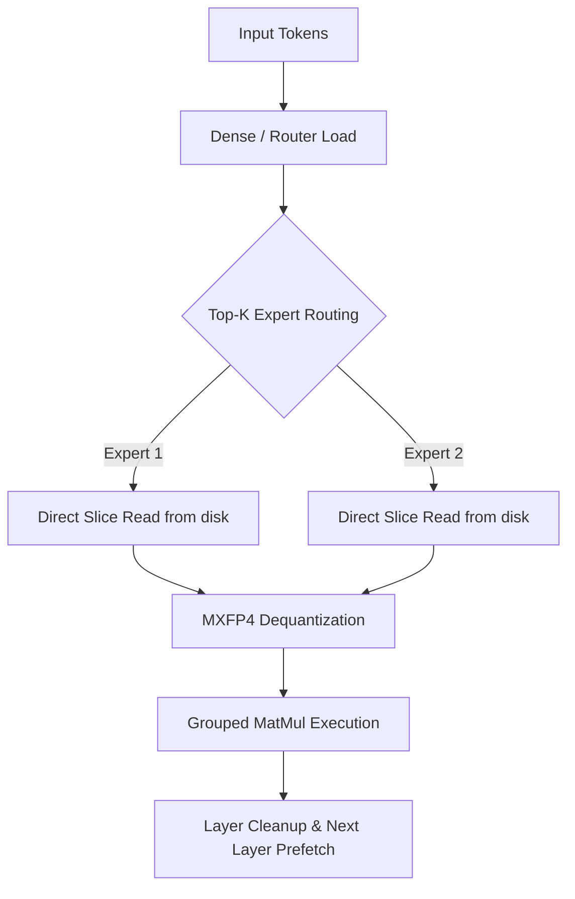

# BetterAirLLM


[**Quickstart**](#quickstart) |
[**Server API**](#openai-compatible-server) |
[**Desktop UI**](#desktop-ui) |
[**Model Support**](#mixture-of-experts-moe-status--details) |
[**MoE Status & Details**](#mixture-of-experts-moe-status--details) |
[**Ollama Proxy**](#using-ollama-models-through-betterairllm) |
[**CLI Tools**](#cli-utilities-reference) |
[**FAQ**](#faq)

**BetterAirLLM** is a local large-model inference stack built on AirLLM-style layer streaming. This repository includes an OpenAI-compatible FastAPI server, a multi-model registry, Ollama GGUF proxy support, experimental MoE selective expert paths, GPT-OSS/Qwen smoke and benchmark tools, and a Next.js desktop chat shell.

The core memory goal is unchanged: keep only the active pieces of a model resident while streaming weights from disk, so larger Hugging Face checkpoints can run on smaller GPUs than full-model loading would normally allow. The new server path exposes that runtime through `/v1/models`, `/v1/chat/completions`, `/v1/capabilities`, `/v1/runtime`, and per-model preflight checks.

---

## What's New In This Repo

* **OpenAI-Compatible Backend**: Fast API implementation in `server.py` with streaming (SSE) and non-streaming chat completions.
* **Multi-Model Registry**: Configurable in `model_registry.json`, with dynamic overrides via environment variables.
* **Ollama Discovery & Proxying**: Exposes local GGUF models as `ollama/<model-name>` on the fly.
* **Experimental MoE Selective Runtime**: `BetterAirLLMMoE` dispatching for Qwen3.5/Qwen3.6 MoE and GPT-OSS (20B and 120B) configurations.
* **MXFP4 Direct Slice execution**: Highly granular, memory-efficient direct disk reading for selected MoE experts without loading dense weight blocks.
* **Staged Diagnostics**: Extensive preflight and benchmark CLI scripts validating runtime, hardware allocations, and split operations.

---

## Quickstart

### 1. Install Dependencies

Create a virtual environment, install server dependencies, and ensure the local `better_air_llm` library is accessible:

```powershell
python -m venv .venv
.\.venv\Scripts\Activate.ps1
pip install -r requirements-server.txt
```

For development, testing, and profiling utilities:

```powershell
pip install -r requirements-dev.txt
```

### 2. Start the OpenAI-Compatible Server

```powershell
python server.py
```

The server listens on `http://localhost:8000` by default and loads models lazily on demand.

To configure a custom model or local Hugging Face path at startup:

```powershell
$env:BETTERAIRLLM_MODEL = "Qwen/Qwen3-30B-A3B"
$env:BETTERAIRLLM_MODEL_ID = "qwen3-30b-a3b"
python server.py
```

### 3. Inspect System Status

Validate the health check and runtime endpoint outputs:

```powershell
Invoke-RestMethod http://localhost:8000/health | ConvertTo-Json -Depth 8
Invoke-RestMethod http://localhost:8000/v1/models | ConvertTo-Json -Depth 8
Invoke-RestMethod http://localhost:8000/v1/capabilities | ConvertTo-Json -Depth 8
Invoke-RestMethod http://localhost:8000/v1/runtime | ConvertTo-Json -Depth 8
```

### 4. Send a Chat Completion Request

```powershell
$body = @{
  model = "mistral-7b-instruct"
  messages = @(@{ role = "user"; content = "Why is the sky blue?" })
  max_tokens = 64
  stream = $false
} | ConvertTo-Json -Depth 10

Invoke-RestMethod `
  -Uri http://localhost:8000/v1/chat/completions `
  -Method Post `
  -ContentType "application/json" `
  -Body $body | ConvertTo-Json -Depth 10
```

---

## OpenAI-Compatible Server

The server accepts standard OpenAI request shapes and handles both native BetterAirLLM models and proxied local Ollama instances.

### REST API Endpoints

#### 1. `GET /health`

Returns server readiness, current loaded model, and detailed Ollama daemon connectivity.

* **Example Response**:

  ```json
  {
    "status": "healthy",
    "loaded_model": null,
    "ollama": {
      "connected": true,
      "base_url": "http://localhost:11434",
      "model_count": 2
    }
  }
  ```

#### 2. `GET /v1/models`

Lists all available models. Combines local `model_registry.json` entries with discovered Ollama GGUF models.

* **Example Response**:

  ```json
  {
    "object": "list",
    "data": [
      {
        "id": "mistral-7b-instruct",
        "object": "model",
        "created": 1716474000,
        "owned_by": "betterairllm",
        "source": "hf",
        "backend": "betterairllm"
      },
      {
        "id": "ollama/llama3.2:3b",
        "object": "model",
        "created": 1716474000,
        "owned_by": "ollama",
        "source": "ollama",
        "backend": "ollama"
      }
    ]
  }
  ```

#### 3. `GET /v1/capabilities`

Lists all supported runtime architectures, execution backends, and current feature gate flags.

* **Example Response**:

  ```json
  {
    "backends": ["betterairllm", "ollama"],
    "moe_supported": true,
    "triton_kernel_available": false,
    "caching": {
      "vram_cache_mode": "packed_experts",
      "vram_cache_mb": 4000,
      "cpu_cache_mb": 12000
    }
  }
  ```

#### 4. `GET /v1/runtime`

Returns real-time telemetry metrics, memory cache hits/misses, and execution timings for the active loaded model. It also includes comprehensive host/accelerator hardware stats for CPU, RAM, CUDA, and MPS (Apple Silicon).

* **Example Response**:

  ```json
  {
    "active_model_id": "qwen3.6-35b-a3b",
    "runtime_parameters": {
      "device": "cuda:0",
      "dtype": "float16",
      "compression": null
    },
    "metrics": {
      "last_generation_tokens": 16,
      "last_generation_seconds": 4.12,
      "average_seconds_per_token": 0.257,
      "expert_cache_hits": 345,
      "expert_cache_misses": 15
    },
    "hardware": {
      "device": "cuda:0",
      "cuda_available": true,
      "mps_available": false,
      "torch_version": "2.11.0+cu128",
      "os": {
        "system": "Windows",
        "release": "10",
        "version": "10.0.19045",
        "machine": "AMD64",
        "python_version": "3.13.0"
      },
      "cuda": {
        "device_index": 0,
        "name": "NVIDIA GeForce RTX 5060",
        "total_vram_mb": 8192,
        "allocated_mb": 1024,
        "reserved_mb": 1152,
        "max_allocated_mb": 4096
      },
      "workspace_disk": {
        "path": "C:\\Users\\User\\Desktop\\Projects\\BetterAirLLM",
        "total_mb": 953869,
        "free_mb": 453120,
        "used_mb": 500749
      },
      "ram": {
        "total_mb": 32640,
        "available_mb": 18240,
        "used_mb": 14400,
        "percent": 44.1
      },
      "cpu": {
        "percent": 12.5,
        "cores_physical": 8,
        "cores_logical": 16
      }
    }
  }
  ```

#### 5. `GET /v1/models/{model_id}/preflight`

Performs static dependency and environment checkouts for a given model prior to loading. Evaluates RAM/VRAM availability, local shard layout, and split compatibility.

* **Example Response**:

  ```json
  {
    "model_id": "qwen3.6-35b-a3b",
    "compatible": true,
    "required_vram_mb": 5120,
    "available_vram_mb": 8192,
    "split_path_hint": "splitted_model.moe",
    "warnings": []
  }
  ```

#### 6. `POST /v1/models/{model_id}/load`

Explicitly triggers pre-loading and caching of the specified model (Hugging Face / Local) into system/VRAM memory prior to starting chat playground interactions.

* **Example Response**:

  ```json
  {
    "status": "ok",
    "message": "Model 'mistral-7b-instruct' loaded successfully.",
    "model_id": "mistral-7b-instruct"
  }
  ```

#### 7. `POST /v1/models/{model_id}/unload`

Explicitly ejects a model from active memory cache, cleans Python references, and calls accelerator cache purges (e.g., `torch.cuda.empty_cache()` or `torch.mps.empty_cache()`) to release VRAM.

* **Example Response**:

  ```json
  {
    "status": "ok",
    "message": "Model 'mistral-7b-instruct' unloaded successfully.",
    "model_id": "mistral-7b-instruct"
  }
  ```

#### 6. `POST /v1/chat/completions`

Standard endpoint for text generation. Supports `stream = true` utilizing Server-Sent Events (SSE).

* **Streaming Modes**:
  * `true` / `auto`: Streams Standard SSE event chunks (`data: {...}`).
  * `compat`: Streams raw content chunks for incompatible client libraries.

---

## FastAPI Server Environment Variables

Tune the server using the following variables:

| Variable | Default | Description |
| --- | --- | --- |
| **BETTERAIRLLM_HOST** | `0.0.0.0` | Bind IP address for the FastAPI server. |
| **BETTERAIRLLM_PORT** | `8000` | Bind port number. |
| **BETTERAIRLLM_DEVICE** | `cuda:0` | Target PyTorch device for layer execution. |
| **BETTERAIRLLM_DENSE_DEVICE** | `None` | Custom device override specifically for dense layer execution. |
| **BETTERAIRLLM_DTYPE** | `float16` | Data type for weights (`float16`, `bfloat16`, `float32`). |
| **BETTERAIRLLM_MODELS** | `None` | JSON array overriding the contents of `model_registry.json`. |
| **BETTERAIRLLM_MODEL** | `None` | Prepends a single custom model repo/path to the list. |
| **BETTERAIRLLM_MODEL_ID** | Derived | Custom ID to assign to the model defined by `BETTERAIRLLM_MODEL`. |
| **BETTERAIRLLM_COMPRESSION** | `None` | Custom model compression override (`4bit` or `8bit`). |
| **BETTERAIRLLM_MAX_SEQ_LEN** | `2048` | Sequence length override for custom model configuration. |
| **BETTERAIRLLM_PREFETCH** | `True` | Overlaps layer weight loading with execution in a separate thread. |
| **BETTERAIRLLM_USE_HARMONY_PROMPT** | `True` | Formats inputs via model's chat templates (e.g., GPT-OSS Harmony). |
| **BETTERAIRLLM_REASONING_EFFORT** | `low` | Reasoning effort parameter for compatible chat templates. |
| **BETTERAIRLLM_MAX_VRAM_MB** | `7600` | Maximum VRAM limit allowed for model allocation. |
| **BETTERAIRLLM_MXFP4_DEVICE** | `cuda` | Target device for performing MXFP4 unpack operations. |
| **BETTERAIRLLM_EXPERT_MATMUL_DEVICE** | `cuda` | Target device for executing MoE expert matrix multiplications. |
| **BETTERAIRLLM_VRAM_CACHE_MODE** | `packed_experts` | MoE caching mode (`off`, `packed_experts`, `dense_layers`, `hybrid`). |
| **BETTERAIRLLM_VRAM_CACHE_MB** | `4000` | Target size of VRAM dedicated to caching loaded experts. |
| **BETTERAIRLLM_CPU_CACHE_MB** | `12000` | Target size of host RAM dedicated to caching experts. |
| **BETTERAIRLLM_LAYER_CLEANUP_INTERVAL** | `8` | How frequently to flush cached layers from RAM. |
| **BETTERAIRLLM_MXFP4_EXECUTION** | Derived | Engine execution mode (`reference_cuda`, `hf_triton`, `triton_fused`). |
| **BETTERAIRLLM_HF_TRITON_MODULE_CACHE_MB** | `0` | Size of VRAM allocated to cache compiled Triton modules. |
| **BETTERAIRLLM_EXPERT_EXECUTION_MODE** | `grouped_by_expert` | Execution strategy (`per_token` or `grouped_by_expert`). |
| **BETTERAIRLLM_OS_RESERVED_RAM_MB** | `8192` | Host RAM buffer reserved for operating system stability. |
| **BETTERAIRLLM_QUIET_PROGRESS** | `True` | Disables verbose tqdm progress bars in console output. |
| **BETTERAIRLLM_MAX_LOADED_MODELS** | `1` | Size of the LRU cache for active in-memory models. |
| **BETTERAIRLLM_STREAM_MODE** | `auto` | Formatting mode for streaming (`auto`, `true`, `compat`). |
| **BETTERAIRLLM_ENABLE_RUNTIME_METRICS** | `True` | Records generation metrics for `/v1/runtime`. |
| **BETTERAIRLLM_DISCOVER_OLLAMA** | `True` | Toggles dynamic local Ollama service polling. |
| **BETTERAIRLLM_OLLAMA_BASE_URL** | `http://localhost:11434` | Target Ollama endpoint. |
| **BETTERAIRLLM_OLLAMA_TIMEOUT_SECONDS** | `5.0` | Timeout threshold when querying Ollama API. |
| **BETTERAIRLLM_OLLAMA_DISCOVERY_TTL_SECONDS** | `10.0` | Cache duration (TTL) for Ollama tags. |
| **HF_TOKEN** | `None` | Hugging Face Hub authentication token for gated repositories. |

---

## Python API Reference

You can import and run the underlying sequential execution runtime directly:

```python
from betterairllm import AutoModel

model = AutoModel.from_pretrained(
    "mistralai/Mistral-7B-Instruct-v0.1",
    device="cuda:0",
    dtype="float16",
    max_seq_len=2048,
)
```

### Constructor Parameters (`AutoModel.from_pretrained`)

| Parameter | Type | Default | Description |
| --- | --- | --- | --- |
| **model_name** | `str` | *Required* | Hugging Face repository ID or path to local checkpoint folder. |
| **device** | `str` | `"cuda:0"` | Target PyTorch execution device. |
| **dense_device** | `Optional[str]` | `None` | Alternative device specifically for dense (non-transformer) layers. |
| **dtype** | `torch.dtype` | `torch.float16` | Precision type (`float16`, `bfloat16`, `float32`). |
| **max_seq_len** | `int` | `2048` | Maximum sequence length configuration for context window. |
| **compression** | `Optional[str]` | `None` | Enable weight compression (`"4bit"` or `"8bit"` quantization). |
| **prefetching** | `bool` | `True` | Prefetch the next layer weights in the background during compute. |
| **moe_expert_sharding** | `bool` | `False` | Enables sharding of MoE expert blocks during initialization. |
| **moe_strict_streaming** | `bool` | `True` | Enforces streaming execution. Refuses fallback to full-dense loading. |
| **moe_allow_dense_fallback** | `bool` | `False` | Permits loading all experts into memory if streaming fails. |
| **os_reserved_ram_mb** | `int` | `8192` | Memory safety reserve to prevent OS OOMs. |
| **abort_unsafe_context** | `bool` | `True` | Throws an error early if context size exceeds hardware capacity. |
| **resume_split_build** | `bool` | `True` | Resume incremental MoE construction if interrupted. |
| **lazy_build** | `bool` | `True` | Constructs split expert shards dynamically during execution. |
| **expert_materialization_mode** | `str` | `"direct_slice"` | Selected expert read mode (`"direct_slice"` or `"full_shard"`). |
| **layer_cleanup_interval** | `int` | `8` | How frequently to clean processed layers from device memory. |
| **mxfp4_device** | `str` | `"cuda"` | Target execution device for dequantizing MoE weights. |
| **expert_matmul_device** | `str` | `"cuda"` | Target device for MoE expert matrix multiplication. |
| **max_vram_mb** | `int` | `7600` | VRAM safety limit for execution. |
| **keep_nontransformer_resident** | `bool` | `True` | Keep embeddings and projection layers resident in VRAM. |
| **quiet_progress** | `bool` | `False` | Disables tqdm progress bars during operations. |

---

## Mixture of Experts (MoE) Status & Details

BetterAirLLM implements a memory-efficient MoE streaming path. The system splits MoE layers dynamically on disk, keeping only the routing parameters and active experts resident.



### Supported Layouts & Optimizations

* **Selective routed expert execution**: Isolates and loads only active expert tensors.
* **MXFP4 Quantization Unpacking**: Decodes Microscaled Formats 4-bit (MXFP4) weights on the fly (specifically designed for GPT-OSS).
* **Dynamic Lazy Splitting**: Automatically splits Hugging Face checkpoints into structured directory indices (`splitted_model.moe`) incrementally during generation.
* **Triton Kernel Support**: Can leverage community Triton kernels (`kernels-community/gpt-oss-triton-kernels`) for fast fused dequantization/matmul.

---

## CLI Utilities Reference

The `scripts/` directory contains tools to dry-run, benchmark, and smoke-test MoE layouts.

### 1. `scripts/probe_moe_layout.py`

Probes Hugging Face checkpoints to read metadata, map out layout architectures, and verify compatibility configurations without downloading large tensor weights.

* **Arguments**:
  * `model`: Repository ID or local folder.
  * `--no-full-download`: Skips downloading any weight shards.
  * `--verify-manifest`: Validates correctness of structural descriptors.
  * `--download-one-expert`: Downloads a single expert weight shard for testing.
* **Example**:

  ```powershell
  python scripts/probe_moe_layout.py openai/gpt-oss-20b --no-full-download --verify-manifest
  ```

### 2. `scripts/benchmark_gb_per_token.py`

Performs static memory and bandwidth requirement estimations based on sequence lengths, top-k configurations, and cache settings.

* **Arguments**:
  * `model`: Model repository or local path.
  * `--dry-run-layout`: Calculates estimates without loading weights.
  * `--max-seq-len`: Context window size to simulate.
  * `--confirm-real-run`: Required flag to execute actual CUDA runs.
* **Example**:

  ```powershell
  python scripts/benchmark_gb_per_token.py openai/gpt-oss-20b --dry-run-layout --max-seq-len 1024
  ```

### 3. `scripts/benchmark_mxfp4_selected_expert.py`

Compares the performance and throughput of reference CPU/CUDA dequantization loops against custom Triton kernels.

* **Arguments**:
  * `model`: Model directory or checkpoint path.
  * `--num-tokens`: Batch size/tokens count to benchmark.
* **Example**:

  ```powershell
  python scripts/benchmark_mxfp4_selected_expert.py openai/gpt-oss-20b --num-tokens 64
  ```

### 4. `scripts/benchmark_server_chat.py`

Measures response latency and Time-To-First-Token (TTFT) on the `/v1/chat/completions` API server endpoint.

* **Arguments**:
  * `--base-url`: API base path (defaults to `http://localhost:8000/v1`).
  * `--model`: Target model identifier.
  * `--prompt`: Input query to test.
  * `--mode`: Select `both`, `streaming`, or `non_streaming`.
* **Example**:

  ```powershell
  python scripts/benchmark_server_chat.py --model mistral-7b-instruct --mode both
  ```

### 5. `scripts/benchmark_split_build.py`

Benchmarks the processing throughput and disk write speeds of model partition splitting.

* **Arguments**:
  * `model`: Target Hugging Face model repository.
  * `--output-dir`: Local folder where shards should be written.
  * `--resume-split-build`: Resumes interrupted splitting processes.
* **Example**:

  ```powershell
  python scripts/benchmark_split_build.py openai/gpt-oss-20b --resume-split-build
  ```

### 6. `scripts/check_gpt_oss_triton_kernel.py`

Tests the local Python environment to determine if the Triton kernel dependencies (`triton`, `torch`, `kernels`) are properly compiled and active.

* **Example**:

  ```powershell
  python scripts/check_gpt_oss_triton_kernel.py
  ```

### 7. `scripts/smoke_qwen35_text_generation.py`

A lightweight script executing a short, single-pass generation test using Qwen3.5 MoE checkpoints.

* **Example**:

  ```powershell
  python scripts/smoke_qwen35_text_generation.py Qwen/Qwen3.6-35B-A3B --max-new-tokens 8
  ```

### 8. `scripts/run_gpt_oss_streaming.py`

Runs direct generation on GPT-OSS checkpoints using direct-slice reading and outputs token-by-token performance profiles.

* **Arguments**:
  * `model`: GPT-OSS checkpoint directory.
  * `--prompt`: Input query.
  * `--confirm-120b`: Mandatory flag to execute runs on the 120B variant.
  * `--profile-speed`: Records detailed execution traces to JSON.
* **Example**:

  ```powershell
  python scripts/run_gpt_oss_streaming.py ./models/gpt-oss-20b --prompt "Explain quantum computing." --confirm-120b
  ```

### 9. `scripts/smoke_gpt_oss_20b_one_token.py`

Runs verification checks for GPT-OSS 20B, validating memory footprint, Triton availability, and lazy shard assembly.

* **Example**:

  ```powershell
  python scripts/smoke_gpt_oss_20b_one_token.py openai/gpt-oss-20b --one-token-real --lazy-build --confirm-real-run
  ```

---

## Desktop UI

The `desktop/` application is a fully integrated, state-of-the-art **Next.js Single-Page Control Center** for your local LLM server. It connects directly to the running server to provide real-time metrics, registry lookups, loading actions, and a full-featured streaming playground.

### Key Features

* **Real-time Telemetry Widgets**: Visually tracks CPU load (threads/cores), System RAM %, and VRAM (NVIDIA CUDA VRAM or Apple Silicon MPS Unified Memory allocation).
* **VRAM Cache Controller**: Lists all models currently loaded in the memory cache, allowing you to manually trigger **Unload** events to free resources instantly.
* **Unified Registry Card System**: Explores all downloaded Hugging Face weights and locally discovered Ollama daemon models. Trigger a manual **Load** pre-caching action, or launch directly into chat.
* **Streaming Chat Console**: Select any registered model, clear thread history, and stream outputs via standard Server-Sent Events (SSE) complete with full Markdown rendering.

### Getting Started

1. Start your local FastAPI backend first:

   ```powershell
   python server.py
   ```

2. Navigate to the desktop directory, install dependencies, and launch:

   ```powershell
   cd desktop
   npm install
   npm run dev
   ```

3. Open `http://localhost:3000` in your web browser. Everything connects automatically out-of-the-box!

For comprehensive details on telemetry architecture, environmental overrides, premium styling features, and advanced deployment options, refer directly to the [**Desktop App README**](desktop/README.md).

---

## Using Ollama Models Through BetterAirLLM

BetterAirLLM can expose models already downloaded by Ollama through the same OpenAI-compatible server. Ollama GGUF models are listed as `ollama/<model-name>` and proxied to the local Ollama OpenAI-compatible API.

Start BetterAirLLM:

```powershell
python server.py
```

List all available BetterAirLLM and Ollama models:

```powershell
Invoke-RestMethod http://localhost:8000/v1/models | ConvertTo-Json -Depth 8
```

Call an Ollama model through BetterAirLLM:

```powershell
$body = @{
  model = "ollama/llama3.2:3b"
  messages = @(
    @{ role = "user"; content = "Say hello from Ollama through BetterAirLLM." }
  )
  max_tokens = 64
  stream = $false
} | ConvertTo-Json -Depth 10

Invoke-RestMethod `
  -Uri http://localhost:8000/v1/chat/completions `
  -Method Post `
  -ContentType "application/json" `
  -Body $body | ConvertTo-Json -Depth 10
```

### Ollama Troubleshooting

* If `/v1/models` does not show `ollama/...` models, make sure Ollama is running and `Invoke-RestMethod http://localhost:11434/api/tags` works.
* If BetterAirLLM reports that Ollama blobs exist but the daemon is unavailable, start or restart Ollama.
* If a request fails for `ollama/<name>`, check that `<name>` exactly matches `ollama list`.
* GGUF models are not loaded through BetterAirLLM directly. They use the Ollama backend. Use Hugging Face or local safetensors checkpoints for the BetterAirLLM backend.

---

## macOS & Apple Silicon

BetterAirLLM fully supports macOS platforms running on Apple Silicon (M1/M2/M3/M4/etc.) out of the box, utilizing PyTorch **MPS (Metal Performance Shaders)**:

* **Hardware Metrics**: The server automatically discovers the MPS backend, queries driver-allocated shared unified memory, and reports real-time usage stats directly to the dashboard.
* **Accelerator Cache Purging**: Manual model unloading calls `torch.mps.empty_cache()` to clean state.
* **Dependencies**:
  * Make sure you have installed torch and [mlx](https://github.com/ml-explore/mlx?tab=readme-ov-file#installation) (for GGUF conversions/acceleration).
  * Only Apple Silicon chips are supported for GPU-accelerated layer streaming.

Example [python notebook](https://github.com/medenmite/BetterAirLLM/blob/main/air_llm/examples/run_on_macos.ipynb)

---

## FAQ

### 1. MetadataIncompleteBuffer

`safetensors_rust.SafetensorError: Error while deserializing header: MetadataIncompleteBuffer`

Most likely cause is running out of disk space during model splitting. The process of splitting models is disk-intensive. Clear the Hugging Face cache directory and check your remaining disk space before restarting.

### 2. ValueError: max() arg is an empty sequence

Most likely you are loading Qwen or ChatGLM models using the generic Llama2 class. Use `AutoModel` instead:

```python
from betterairllm import AutoModel
AutoModel.from_pretrained(...)
```

### 3. 401 Client Error: Repo model is gated

Some models require Hugging Face Hub agreement confirmation. Pass your authentication token during model initialization:

```python
model = AutoModel.from_pretrained("meta-llama/Llama-2-7b-hf", hf_token='HF_API_TOKEN')
```

### 4. ValueError: Asking to pad but the tokenizer does not have a padding token

Ensure you set padding configurations to `False` on models whose tokenizers do not define padding tokens:

 ```python
input_tokens = model.tokenizer(
    input_text,
    return_tensors="pt", 
    return_attention_mask=False, 
    truncation=True, 
    max_length=MAX_LENGTH, 
    padding=False
)
```

---

## Citing BetterAirLLM

If you find BetterAirLLM useful in your research, please cite it:

```bibtex
@software{betterairllm2026,
  author = {medenmite},
  title = {BetterAirLLM: scaling large language models on low-end commodity computers},
  url = {https://github.com/medenmite/BetterAirLLM/},
  version = {2.11.0},
  year = {2026},
}
```
